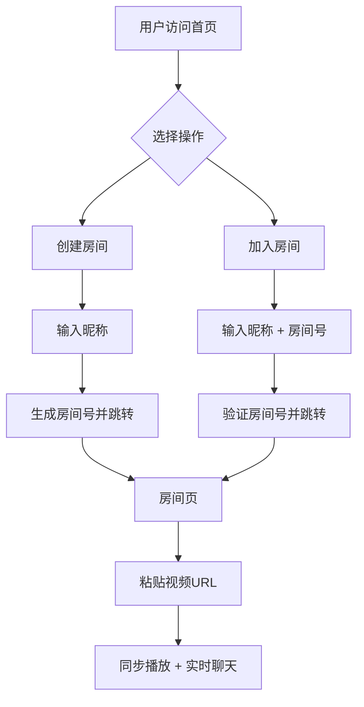

## 1. 产品概述

SyncWatch 是一个实时同步观影平台，让用户可以和朋友在同一虚拟房间内同步观看视频，并实时文字聊天。
- 解决异地朋友无法一起看视频的社交需求，提供低延迟的同步播放体验
- 目标用户为有远程社交观影需求的年轻用户群体

## 2. 核心功能

### 2.1 用户角色

| 角色 | 注册方式 | 核心权限 |
|------|----------|----------|
| 房主 | 无需注册，输入昵称即可 | 创建房间、设置视频源、控制播放同步 |
| 参与者 | 无需注册，输入昵称+房间号加入 | 加入房间、同步观看、发送聊天消息 |

### 2.2 功能模块

1. **首页**: 创建房间 / 加入房间入口，品牌展示
2. **房间页**: 视频同步播放器 + 实时聊天侧栏 + 在线用户列表

### 2.3 页面详情

| 页面名称 | 模块名称 | 功能描述 |
|----------|----------|----------|
| 首页 | Hero 区域 | 产品名称、宣传语、动态背景粒子效果 |
| 首页 | 创建房间卡片 | 输入昵称，点击创建房间，自动生成房间号 |
| 首页 | 加入房间卡片 | 输入昵称 + 房间号，加入已有房间 |
| 房间页 | 视频播放器 | 支持粘贴视频URL嵌入播放，播放/暂停/跳转自动同步到所有用户 |
| 房间页 | 同步控制栏 | 显示当前同步状态、延迟指示器、房主标识 |
| 房间页 | 聊天侧栏 | 实时文字消息、系统通知（加入/离开）、用户列表 |
| 房间页 | 房间信息栏 | 房间号显示、复制邀请链接、退出房间按钮 |

## 3. 核心流程

**创建房间流程**: 用户打开首页 → 输入昵称 → 点击"创建房间" → 系统生成6位房间号 → 跳转至房间页 → 粘贴视频URL开始播放 → 房主操作自动同步给所有参与者

**加入房间流程**: 用户打开首页 → 输入昵称和房间号 → 点击"加入房间" → 跳转至房间页 → 视频自动同步至当前播放进度 → 可参与聊天

**同步机制**: 房主执行播放/暂停/跳转操作 → WebSocket 广播操作指令 → 所有客户端同步执行相同操作 → 参与者仅可观看和聊天，播放控制由房主统一管理

## 4. 用户界面设计

### 4.1 设计风格

- **主题**: 暗色影院风格，营造沉浸式观影氛围
- **主色**: 深空黑 (#0a0a0f) + 霓虹蓝 (#00d4ff) 作为主强调色
- **辅助色**: 暗紫 (#1a1a2e)、柔和灰 (#8b8b9e)
- **按钮风格**: 圆角半透明玻璃态按钮，hover 时发出霓虹光晕
- **字体**: 标题使用 Outfit (现代几何感)，正文使用 Noto Sans SC (中文友好)
- **布局**: 视频播放器占主区域 70%，右侧聊天面板 30%
- **图标**: Lucide 图标库，线条风格与霓虹主题搭配

### 4.2 页面设计概览

| 页面名称 | 模块名称 | UI 元素 |
|----------|----------|---------|
| 首页 | Hero 区域 | 深色渐变背景 + 粒子动画、大标题 "SyncWatch"、副标题说明 |
| 首页 | 创建房间卡片 | 玻璃态卡片、昵称输入框、霓虹蓝"创建房间"按钮 |
| 首页 | 加入房间卡片 | 玻璃态卡片、昵称输入框、房间号输入框、"加入房间"按钮 |
| 房间页 | 视频播放器 | 深色嵌入播放器、底部自定义控制栏（同步状态指示灯） |
| 房间页 | 聊天侧栏 | 暗色背景、消息气泡、系统消息灰色标识、底部输入框 |
| 房间页 | 顶部信息栏 | 房间号、复制链接按钮、在线人数、退出按钮 |

### 4.3 响应式设计

- 桌面端优先（1920x1080 为基准）
- 平板端：聊天面板可折叠为底部抽屉
- 移动端：视频全宽，聊天以浮动按钮展开为全屏弹窗

### 4.4 无3D场景
