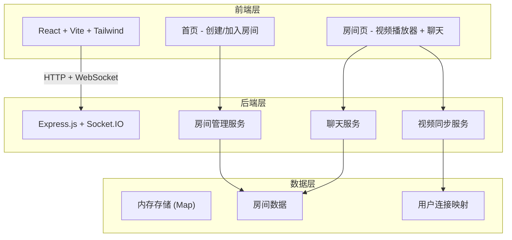
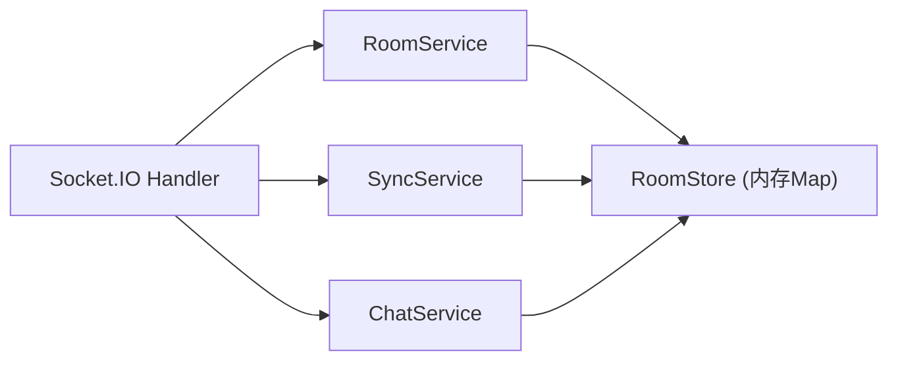
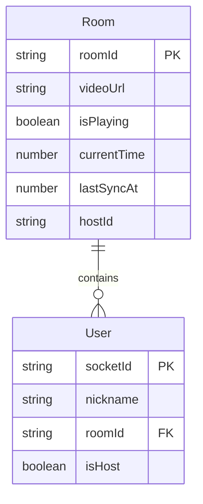

## 1. 架构设计



## 2. 技术说明

* **前端**: React\@18 + TypeScript + Tailwind CSS\@3 + Vite

* **初始化工具**: vite-init (react-express-ts 模板)

* **后端**: Express\@4 + Socket.IO (WebSocket 实时通信)

* **状态管理**: Zustand

* **数据库**: 无需数据库，使用内存存储 (Map)，MVP 阶段足够

* **视频播放**: HTML5 Video + 自定义控制栏，支持直接视频URL

## 3. 路由定义

| 路由              | 用途              |
| --------------- | --------------- |
| `/`             | 首页，创建/加入房间入口    |
| `/room/:roomId` | 房间页，视频同步播放 + 聊天 |

## 4. API 定义

### 4.1 HTTP API

```typescript
// 创建房间
POST /api/rooms
Request: { nickname: string }
Response: { roomId: string; nickname: string }

// 加入房间
POST /api/rooms/:roomId/join
Request: { nickname: string }
Response: { roomId: string; nickname: string; videoUrl: string | null }

// 获取房间信息
GET /api/rooms/:roomId
Response: { roomId: string; users: string[]; videoUrl: string | null }
```

### 4.2 WebSocket 事件

```typescript
// 客户端 → 服务器
interface ClientToServerEvents {
  "room:join": (data: { roomId: string; nickname: string }) => void;
  "room:leave": (data: { roomId: string }) => void;
  "video:play": (data: { roomId: string; currentTime: number }) => void;
  "video:pause": (data: { roomId: string; currentTime: number }) => void;
  "video:seek": (data: { roomId: string; currentTime: number }) => void;
  "video:url": (data: { roomId: string; url: string }) => void;
  "chat:message": (data: { roomId: string; message: string }) => void;
}

// 服务器 → 客户端
interface ServerToClientEvents {
  "room:userJoined": (data: { nickname: string; users: string[] }) => void;
  "room:userLeft": (data: { nickname: string; users: string[] }) => void;
  "video:play": (data: { currentTime: number }) => void;
  "video:pause": (data: { currentTime: number }) => void;
  "video:seek": (data: { currentTime: number }) => void;
  "video:url": (data: { url: string }) => void;
  "chat:message": (data: { nickname: string; message: string; timestamp: number }) => void;
  "room:sync": (data: { currentTime: number; isPlaying: boolean; videoUrl: string | null }) => void;
}
```

## 5. 服务器架构图



## 6. 数据模型

### 6.1 数据模型定义



### 6.2 数据定义

使用内存 Map 存储，无需 DDL：

```typescript
// 房间数据结构
interface Room {
  roomId: string;
  videoUrl: string | null;
  isPlaying: boolean;
  currentTime: number;
  lastSyncAt: number;
  hostId: string;
}

// 用户数据结构
interface User {
  socketId: string;
  nickname: string;
  roomId: string;
  isHost: boolean;
}
```

